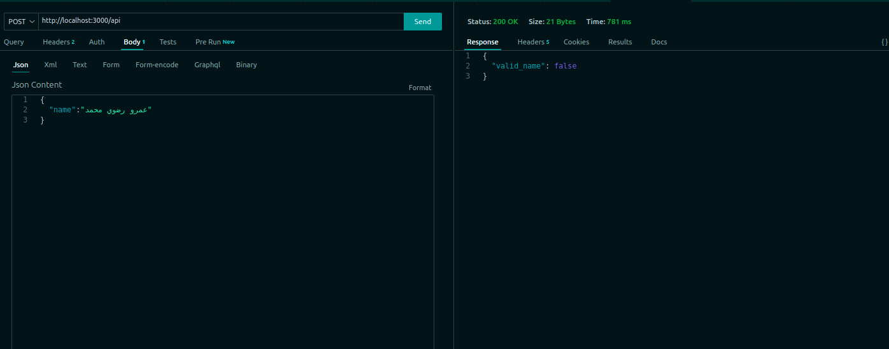
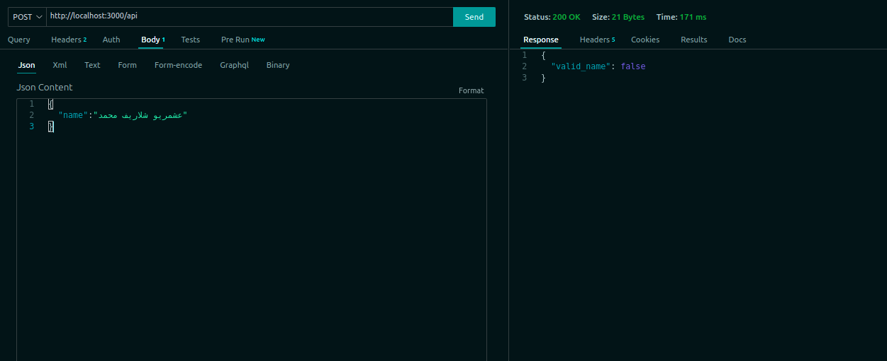

# Model Building

## Build And Run Docker image

- ### Build Docker Image

```bash
sudo docker build -t name_verify_v1 .
```

- you can also pull the docker image from docker hub

```bash
docker pull sawy98/name_verify:name_verify_v1
```

- ### Run Docker Image

```bash
sudo docker run -p 3000:3000 --name name_verify_restapi name_verify_v1
```

- ### Run using Docker-Compose

```bash
sudo docker-compose up
```

## Run Test

- by default it run "عمرو رضوي محمد" if there is no input test is provided

```bash
python ./test.py -i {test input }
```

- The output

```
Time of the response = 0.166522
***********************************************************
{'valid_name': False}
```  

## Test Sample



